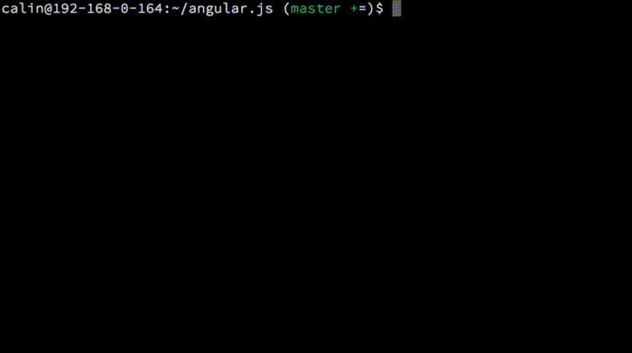

# commit-msg [](https://travis-ci.org/clns/node-commit-msg) [](https://coveralls.io/r/clns/node-commit-msg?branch=master)

commit-msg is a customizable git commit message parser and validator
written in Node.js. It validates a given string based on
[best practices](GUIDELINES.md) and can be used as a git hook,
command line tool and/or directly through the API.

### Default validations

- Subject and body should be separated by an empty line, if body exists
(*error* | *configurable*)
- Subject should be capitalized (*error* | *configurable*)
- Subject has a soft and hard limit for max length (50 and 70)
(*warning* and *error* | *configurable*)
- No consecutive whitespaces allowed in subject (*error*)
- Subject should not end with a period (*error*)
- Only [certain special characters](lib/config.js#L19) are allowed
in the subject (*error* | *configurable*)
- Subject can be prefixed with certain [type: component: ](lib/config.js#L29)
and [invalid types](lib/config.js#L36) can de detected (*error* | *configurable*)
- [GitHub issue references](https://help.github.com/articles/closing-issues-via-commit-messages/)
should be placed in the last paragraph of the body and they should
exist on GitHub (*error* | *configurable*)
- Detection of non-imperative verbs in subject, eg. "Fixes bug" or "Fixed bug"
instead of "Fix bug" (*error* | *configurable*)
- Body lines should be wrapped at 72 characters (*warning* | *configurable*)

### Disclaimer

> Only use it if you agree with the guidelines it follows and
if the customization it offers is enough to meet your needs. I will not accept
changes that do not adhere to the general rules outlined in the
[guidelines](GUIDELINES.md) document, unless they come
with very compelling reasons.

## Installation

> Note: This module is currently in active development (hence the 0.x version)
and a stable v1.0.0 will be released in a few weeks. For this to happen it
just needs more testing from the community, because the feature set is
rather complete.

### Prerequisites

- [Node.js](https://nodejs.org/) 0.12 or newer
- [Java 8](http://www.oracle.com/technetwork/java/javase/downloads/jdk8-downloads-2133151.html)
or newer (required by the parser)

### Install

The commands below should be run from your project's root directory.

> IMPORTANT: On Windows, make sure you run the commands
using *administrator* rights.
Eg. open PowerShell using *Run as administrator*.

```sh
npm install commit-msg
```

This will install (symlink) the [`commit-msg`](bin/commit-msg)
and [`update`](bin/update) hooks in your repo's `hooks/`
directory so you are ready to start committing. If any of these hooks
already exist, a message will be displayed and the hooks will remain untouched.
To disable the hooks installation see [Configuration](#configuration).

##### Global install

You can also install it globally using `npm install commit-msg -g` in which
case you can use the command line validator as `commit-msg -h`.

#### Update

Just run the install command again or `npm update commit-msg` if you have
a package.json file.

#### Uninstall

```sh
npm uninstall commit-msg
```

## Configuration

You can configure this module by specifying a `commitMsg` key in your
package.json file. Possible configurations are:

- [any key from the default `config` object](lib/config.js#L8)
- to turn off the validator once installed with hooks see
[disable validation](#disable-validation)
- to disable the hooks auto-install see
[disable hooks auto-install](#disable-hooks-auto-install)

##### Configuration examples

- [Angular's Git Commit Guidelines](https://github.com/angular/angular.js/blob/master/CONTRIBUTING.md#commit) -
[example file](test/resources/angular/package.json)
- [jQuery's Commit Guidelines](https://contribute.jquery.org/commits-and-pull-requests/#commit-guidelines) -
[example file](test/resources/jquery/package.json)
- [Gerrit's Commit message guidelines](http://www.mediawiki.org/wiki/Gerrit/Commit_message_guidelines) -
[example file](test/resources/gerrit/package.json)
- [GNOME's Guidelines for Commit Messages](https://wiki.gnome.org/Git/CommitMessages) -
[example file](test/resources/gnome/package.json)

#### Disable hooks auto-install

You can disable the hooks installation in 2 ways:

1. Set the `no[Client|Server]Hook` key to true in your package.json:

  ```json
  {
    "commitMsg": {
      "noClientHook": true,
      "noServerHook": true
    }
  }
  ```

2. Set the `commitMsg.no[Client|Server]Hook` key to true in `git config`:

  ```sh
  git config commitMsg.noClientHook true
  git config commitMsg.noServerHook true
  ```

#### Disable validation

You can disable the validation by setting `commitMsg: {disable: true, ...}`
in your package.json file.

#### Bypass validation

If you know what you're doing you can skip the validation
altogether using `git commit --no-verify`. Be aware that this
will bypass the *pre-commit* and *commit-msg* hooks.

## Usage

The default usage is through git hooks, that install automatically
when you install the module in a git repository. There are also other
possible usages, explained below.

### Client-side hook

On the client side the [`commit-msg`](bin/commit-msg) hook validates
every commit you make, helping you follow the guidelines possibly
enforced by the remote server you're pushing to.

### Server-side hook

The [`update`](bin/update) hook can be installed in a (bare) repository
on a remote server to enforce your own commit message guidelines.

##### A note on performance

> To greatly improve the validation speed make sure you have the
[optional prerequisites](CONTRIBUTING.md#2-install-the-optional-prerequisites)
installed.

### Manual validation

The validator includes a script for validating messages
directly from the command line. It is located at
[bin/validate](bin/validate) and you can access it from anywhere using
`node <path-to-bin/validate>`, eg:

```sh
# example acessing 'help' from your project root
node node_modules/commit-msg/bin/validate -h
```

Examples below assume the module is installed at `node_modules/commit-msg`
in your project root.

Also see [a note on performance](#a-note-on-performance).

##### Validate any given message(s)

```sh
node node_modules/commit-msg/bin/validate 'Fix bug'
```

##### Validate all commits from the local repository

```sh
git rev-list --all --no-merges | node node_modules/commit-msg/bin/validate stdin
```

##### Validate last 10 commits made by &lt;Author&gt;

```sh
# don't forget to replace <Author>
git rev-list --all --no-merges -10 --author='<Author>' | node node_modules/commit-msg/bin/validate stdin
```

For more examples see the script help.

### Custom references

You can create your own references by simply putting your reference file
in the [lib/references](lib/references) directory. Take a look at the
[github](lib/references/github.js) reference for details on how to
implement one.

Don't forget to disable the github reference to prevent it from being used.
To do this specify `references: {github: false}`
in your package.json file (see [configuration](#configuration)).

### API

For some examples you can check out the [commit-msg](bin/commit-msg)
hook, the [validate](bin/validate) script or the [test files](test).

#### `CommitMessage`

##### `CommitMessage.parse(message[, config], callback)`

- `message` (string) The message to parse
- `config` (true|string|[Config](#commitmessageconfig), optional) The config object,
a string or `true`.
  - if `true` is given, it will search for the first package.json file
  starting from the current directory up, and use the `commitMsg`
  config from it, if any.
  - if string is given, it should be a directory path where the search for
  the package.json file will start, going up
  - if object is given, it will overwrite the default config object
- `callback(err, instance)` (function) The callback that will be called
with the following params:
  - `err` (Error)
  - `instance` ([CommitMessage](#commitmessage))

This is the designated initializer (also validates the message).

##### `CommitMessage.parseFromFile(file[, config], callback)`

- `file` (string) The file path to parse the message from
- *(all other arguments are the same as above)*

##### `<commitMessageInstance>.message: string`

Return the original message as a string.

##### `<commitMessageInstance>.formattedMessages: string`

Return all errors and warnings as a string, one per line, in the same order
as they were generated, including colors.

##### `<commitMessageInstance>.validate(callback)`

- `callback(err, instance)` (function) The callback that will be called
after the validation finishes
  - `err` (Error)
  - `instance` ([CommitMessage](#commitmessage))

This is called automatically by the static methods `parse()` and
`parseFromFile()`.

##### `<commitMessageInstance>.hasErrors(): boolean`

Return true if there are any errors after validation.

##### `<commitMessageInstance>.hasWarnings(): boolean`

Return true if there are any warnings after validation.

#### `CommitMessage.Config`

##### `CommitMessage.Config([cfg]): object`

- `cfg` (object, optional) An object that will overwrite the
[default config object](lib/config.js#L8).

For example, to generate a warning instead of an error for the
capitalized first letter check use:

```js
CommitMessage.parse(
    msg,
    CommitMessage.Config({
        capitalized: { type: CommitMessage.Error.WARNING }
    }),
    function(err, instance) { /* ... */ }
);
```

#### `CommitMessage.Error`

##### `CommitMessage.Error.ERROR: string`

The "error" string.

##### `CommitMessage.Error.WARNING: string`

The "warning" string.

## See it in Action



## Troubleshooting

If you have problems see the [TROUBLESHOOTING](TROUBLESHOOTING.md) page.
